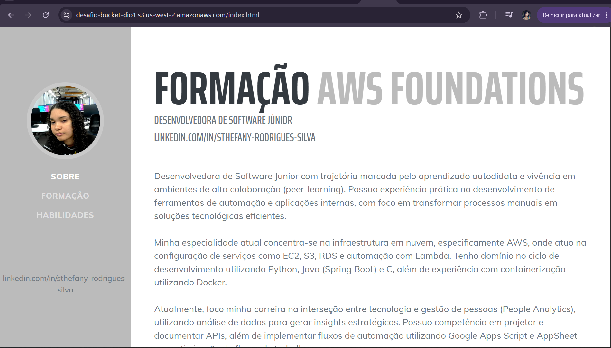

# Desafio - Website AWS (HTML, CSS e JS)

Este projeto faz parte de um desafio prático onde o objetivo era:

- Alterar o HTML do site com relacionados a mim.
- Publicar o site estatico em um bucket, enviando todos os arquivos.

## Evidencia do bucket

Obs: O link do bucket não está mais disponível no momento por isso disponibilizei a imagem.
